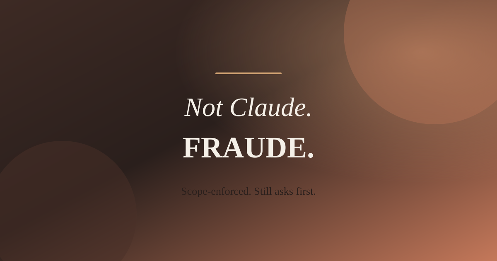

# Fraude



**Framework for Automated Understanding & Discovery of Exploits**

MCP server that lets Claude drive authorized pentest tools (`nmap`, `nuclei`, `semgrep`, `subfinder`, `httpx`) inside hardened Docker containers, gated by a deterministic scope-enforcement layer.

## Status

| Phase | Description | State |
|-------|-------------|-------|
| 1 | Core Foundation & Scope Safety Engine | **Done** |
| 2 | Recon & Scan Tooling Integrations | **Done** |
| 3 | Vulnerability Mapping & HITL Control | **Done** |
| 4 | Reporting + constrained path suggestions | **Done** |
| 5 | Web UI (Anthropic design system) | **Done** |

## Architecture

Flow is linear and fails closed:

1. **Claude / Web UI** calls a tool with a target
2. **Scope validator** checks `scope.yaml` (domains, CIDRs, exclusions)
3. **Docker wrapper** starts a hardened container only if the target is allowed
4. **Tool** runs (`nmap`, `httpx`, `nuclei`, …)
5. **Compressor** turns raw output into a short summary
6. **Audit log** records the decision and execution (JSONL)

```text
Claude / UI
    |
    v
validate_scope  -->  scope.yaml
    |
    v
run_containerized_tool()   <-- single choke point
    |
    +-- denied --> audit + stop
    +-- allowed --> docker run (read-only, non-root, cap-drop)
                      |
                      v
                 compress output --> Claude / UI
                      |
                      v
                 fraude-audit.jsonl
```

No tool may shell out to Docker on its own. Everything goes through `run_containerized_tool()`.

## Quick start

```bash
cd fraude
python3 -m venv .venv && source .venv/bin/activate
pip install -r requirements.txt
cp scope.yaml.example scope.yaml
python -m pytest tests/ -v
```

### MCP server

```bash
export FRAUDE_SCOPE=./scope.yaml
python -m fraude.server
```

### Web UI

```bash
export FRAUDE_SCOPE=./scope.yaml
export FRAUDE_AUDIT=./fraude-audit.jsonl
python -m fraude.ui.app
# open http://127.0.0.1:8787
```

Hero: `assets/fraude-readme-hero.svg` · Mark: `assets/fraude-mark.svg`

## Tools

| Tool | HITL |
|------|------|
| `validate_scope` | no |
| `run_nmap_scan` / `run_subdomain_enum` / `run_http_probe` | no |
| `run_nuclei_scan` / `run_semgrep_scan` / `suggest_attack_path` | **confirm=True** |
| `generate_report` | no |

High-risk tools refuse unless `confirm=True`. Scope still runs first.

## Safety rules

- Scope **fails closed** (missing file, bad YAML, empty scope, missing `authorized_by`)
- Wildcards are **subdomain-only** (`*.example.com` is not the apex)
- **Exclusions beat inclusions**
- Containers: read-only, cap-drop ALL, non-root, memory/CPU limits
- No free-form payload or exploit generator

## License / Authorization

Use only against systems you are authorized to test. The scope gate is not legal authorization.
