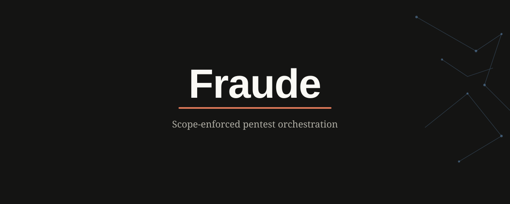

# Fraude



**Framework for Automated Understanding & Discovery of Exploits**

MCP server that lets Claude drive authorized pentest tools (`nmap`, `ffuf`, `nuclei`, `semgrep`, `sublist3r`, `httpx`) inside hardened Docker containers, gated by a deterministic scope-enforcement layer.

## Status

| Phase | Description | State |
|-------|-------------|-------|
| 1 | Core Foundation & Scope Safety Engine | **Done** |
| 2 | Recon & Scan Tooling Integrations | **Done** |
| 3 | Vulnerability Mapping & HITL Control | **Done** |
| 4 | Reporting + constrained path suggestions | **Done** |
| 5 | Web UI (Anthropic design system) | **Done** |

## Quick start

```bash
cd fraude
python3 -m venv .venv && source .venv/bin/activate
pip install -r requirements.txt
cp scope.yaml.example scope.yaml
python -m pytest tests/ -v
```

### MCP server

```bash
export FRAUDE_SCOPE=./scope.yaml
python -m fraude.server
```

### Web UI

```bash
export FRAUDE_SCOPE=./scope.yaml
export FRAUDE_AUDIT=./fraude-audit.jsonl
python -m fraude.ui.app
# open http://127.0.0.1:8787
```

Banner: `assets/fraude-banner.svg` · Mark: `assets/fraude-mark.svg`

## Tools

| Tool | HITL |
|------|------|
| validate_scope | no |
| run_nmap_scan / run_subdomain_enum / run_http_probe | no |
| run_nuclei_scan / run_semgrep_scan / suggest_attack_path | **confirm=True** |
| generate_report | no |

All execution goes through `run_containerized_tool()` (scope choke point).

## License / Authorization

Authorized testing only. Scope gate is not a substitute for legal authorization.
